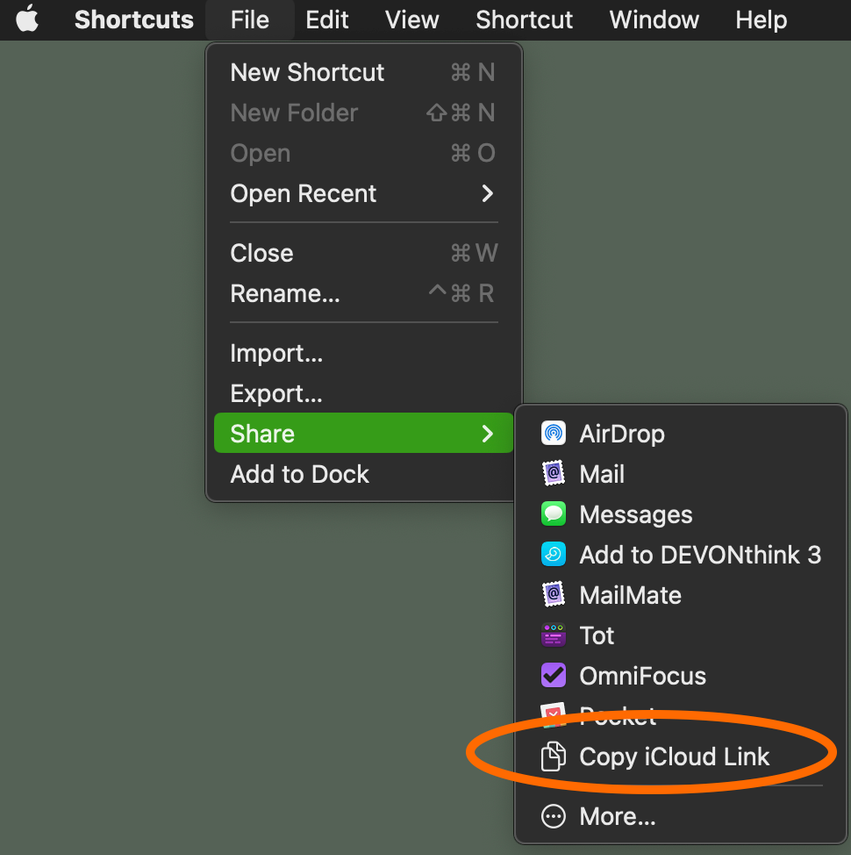

# Scripts for Popstar

This directory contains scripts that are used for Popstar development and producing new releases.

## `get-shortcut-link`

The simplest way to distribute and install Shortcuts is via Apple's iCloud servers. Users then only need to click on a link to install a Shortcut on their device. Unfortunately, the link for a Shortcut can only be obtained manually, by using the "Share" command in the Shortcuts app (either on MacOS or iOS).

<figure>
 
<figcaption>The "Copy iCloud Link" item in the MacOS Shortcuts app.</figcaption>
</figure>

 

This manual process is tedious and error-prone when trying to distribute many different Shortcuts. Astonishingly, for a system designed to enable automation, the Shortcuts application itself has very little API or automation support. In particular, there's no way to request an iCloud link directly, either via the [`shortcuts` command line tool](https://support.apple.com/en-nz/guide/shortcuts-mac/apd455c82f02/mac) or via AppleScript.

We wanted to automate the process of getting iCloud links so that we can provide updated installation links for each release of Popstar. Persevering despite the limitations in Apple's Shortcuts software, we developed [`get-shortcut-link`](get-shortcut-link), a small utility program to get the iCloud link for a named Shortcut. The program is written in AppleScript and uses GUI automation techniques to interact with the Shortcuts app.
