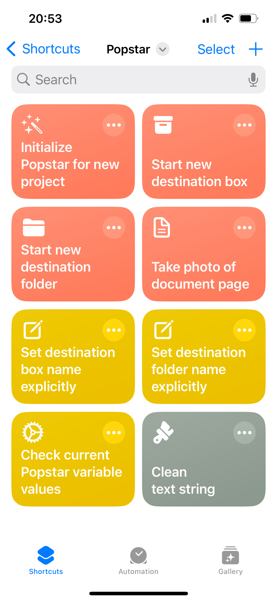

# Popstar: PhOne-based Processing SofTware for ARchives

 For many years, the [Caltech Library Archives](https://library.caltech.edu/archives/home) has been accessioning materials from selected retired faculty members. The traditional approach to digitizing physical materials (e.g., correspondences, notebooks, manuscripts written on typewriters, etc.) has involved the use of scanning tables and manual file organization – which are slow and laborious processes. However, computing technologies have improved so much in recent years that we decided to experiment with workflows that make use of modern devices and software tools. Popstar (_**P**h**o**ne-based **p**rocessing **s**of**t**ware for **ar**chives_) is one of the outcomes.

Popstar is based on Apple iPhone and macOS software and services. Popstar consists of several [_Shortcuts_](https://support.apple.com/guide/shortcuts/welcome/ios), a no-code automation development framework that works on iOS, iPadOS, iWatchOS, and macOS. We used Shortcuts to create workflows that perform scanning and filing of digital images. This document explains Popstar and how we use it in conjunction with additional hardware to create a simple digitization workflow.

## Sections 

```{toctree}
---
maxdepth: 2
---
workflow.md
software.md
keypad.md
glossary.md
colophon.md
```
