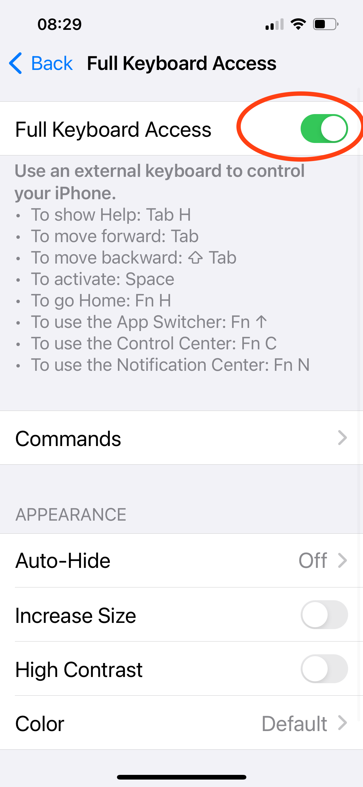

# Installation and configuration

The overall workflow is divided into a number of separate Shortcuts. Some of the Shortcuts – the primary actions in the scanning workflow – are meant to be invoked directly by the user; other Shortcuts act as helpers and are not meant to be invoked by users directly. All of them need to be installed on an iPhone for Popstar to function.

## Software installation

There are two alternative approaches for installing Popstar, with variations possible within those general approaches. In addition, Popstar requires a certain third-party application to be installed as well.

Depending on your needs and preferences, the Popstar software can be installed directly on an iPhone, or it can be installed first on a MacOS computer or an iPad, and then taking advantage of the Apple's automatic synchronization of Shortcuts between devices that share the same Apple account ID. The latter approach only works if the account on the iPhone is tied to the same account on the Mac where the shortcuts are imported; however, editing Shortcuts is more convenient to do on a Mac than on an iPhone, so this approach is preferable for developers.

### Prerequisite software

 The Popstar Shortcuts rely on a free third-party application, [Toolbox Pro](https://toolboxpro.app), that must be installed separately. It can be found in the Apple App Store by searching for "Toolbox Pro". The app icon is a white hammer on a blue-green background; the version number at the time of this writing is 2024.4.

### Approach #1: using iCloud Links

Any Shortcut can be distributed online via Apple's servers such that users only need to open a certain URL and the Shortcuts app will initiate an installation process. We provide iCloud links for Popstar with each release. To install the Shortcuts this way, navigate to the [Popstar releases page on GitHub](https://github.com/caltechlibrary/popstar/releases) using a web browser, then underneath the section heading for the latest release on the page, look for a subsection titled _Installation links for the latest Shortcuts_. Find and click on the link for each Shortcut one at a time to install it.

### Approach #2: using files

Shortcuts can be saved as files, and the resulting files can be imported into the Shortcuts app. The files in the GitHub repository for Popstar can be loaded into the Shortcuts app this way (in effect, using GitHub's servers instead of Apple's iCloud servers). This approach is not recommended for most users because the files on GitHub may represent work in progress and not be in a state suitable for use by people other than the developers.

If you wish to proceed anyway, you can do it in one of two ways:

1. Visit <https://github.com/caltechlibrary/popstar/src> in a web browser, look for the files whose names end in `.shortcut`, and click on each file name in turn to install the Shortcuts.
2. Clone Popstar's GitHub repository to your local Mac computer, then visit the `src` subdirectory in the MacOS Finder, and double-click on each `.shortcut` file to make the Shortcuts app import them.

## Software configuration

Once the Popstar Shortcuts are installed on an iPhone, the following configuration steps need to be performed.

### Make sure iCloud Drive is available in the user account on the iPhone

A paid iCloud Drive subscription may not necessary, depending on how much scanning needs to be performed, but Popstar currently creates all its files in the user's iCloud space, so a free iCloud Drive account must at least be enabled on the phone. To check, open the _Files_ app on the iPhone and check that iCloud Drive is enabled, and that you can open the iCloud Drive folder and create subfolders within it.

<figure>

    <figcaption>Open the iOS <em>Files</em> app on the phone, check that iCloud Drive is available, and also tap on iCloud Drive and make sure you can add content inside it.</figcaption>
</figure>

### Allow Popstar Shortcuts to perform actions

When the Shortcuts are first run, the iOS security mechanisms display alert dialogs asking the user whether the Shortcut should be allowed to perform its actions. Make sure to select the _Always allow_ option when those dialogs are shown. This will avoid iOS asking for permission every time. The best way to handle this is to perform Step 3 and then run all of the Popstar workflow steps; this will cause iOS to ask about everything, and if you consistently select the _Always allow_ option in every dialog, eventually all the permissions will be granted and iOS won't ask again.

### Configure a new project

At the beginning of a new scanning project, run the Shortcut titled _Initialize Popstar for new project_. It will ask a few questions and provide some instructions for steps you need to perform. The following screenshots illustrate what happens.

<figure>

<figcaption>When the Shortcut <em>Initialize Popstar for new project</em> is run, it begins by asking for a name for the scanning project. This name is used to create a folder in the account holder's iCloud Drive.</figcaption>
</figure>

<figure>

<figcaption>Next, it will open the iOS Camera app and ask you to take a picture.</figcaption>
</figure>

<figure>

<figcaption>This step is only done so that you can adjust the camera and make sure it is properly focused. (This is especially important when the phone is mounted above a work surface). The picture that you take must be saved by tapping on "Use Photo", so that you can exit the Camera app, but the picture is not actually used or saved by Popstar.</figcaption>
</figure>

<figure>

<figcaption>Once the initialization workflow completes, it finishes by starting the standard iOS Files app.</figcaption>
</figure>

<figure>

<figcaption>When the Files app open, you can check that the project folder has been created properly in iCloud Drive.</figcaption>
</figure>

This initialization workflow only needs to be performed once at the beginning of a given scanning project, regardless of the number of boxes, folders, or documents to be scanned.

## (Optional) Hardware keypad configuration

The Shortcuts app on an iPhone provides an interface featuring large software "buttons" to run shortcuts, and in fact, is all that's really needed to run the Popstar workflow. However, tapping the buttons is difficult when the phone is mounted over a work surface inside a ring light. For this reason, we have been using a wireless button device to trigger the Popstar workflow steps. The device can be conveniently placed on the work table near where scanning is taking place, making it easy for an archivist to reach while they are working on digitizing materials.

### Device choice

One approach to setting up hardware buttons for triggering workflows is to use a normal external keyboard with an iPhone. For example, an [Apple Magic Keyboard](https://en.wikipedia.org/wiki/Apple_keyboards) would work, and would offer the best compatibility with the iOS environment. The main disadvantages is the desk space taken up by a full keyboard and the potential for users to hit the wrong key. We chose a smaller device for these reasons.

Our current device is a [HUION Keydial Mini Bluetooth Programmable Keypad](https://web.archive.org/web/20240426133138/https://store.huion.com/products/huion-keydial-mini) bought in early April 2024 for approximately US $60.

<figure>

    <figcaption>Our HUION Keydial Mini Bluetooth Programmable Keypad, with custom labels that we printed, skillfully cut, and stuck on the keys we use for the Popstar workflow.</figcaption>
</figure>

There are many similar devices available. The main requirements for a suitable device are the following:

1.  It can be connected to an iPhone _somehow_, whether wirelessly (e.g., via Bluetooth) or wired cable.
2. There are at least three buttons that can send individual keyboard events that the iPhone will interpret as different keys on a keyboard.
3. At least one other button on the keyboard sends the equivalent of the _space_ character on a keyboard. The reason for this requirement is that when assigning keyboard keys to trigger Shortcuts, the iOS interface for assigning keys requires typing two spaces in a row. (See the screenshot at right →)

Not all Bluetooth external keypad devices meet those criteria. The device by HUION was one of three we tried; two of them could be paired with the iPhone and send keyboard characters, but of those two, only the HUION had a key that sent a _space_ character. However, many similar devices can be found in online retailers, and we suspect others would likely also work.

### Device Setup

To enable a device such as the HUION keypad to trigger Shortcuts on iPhones, the only method we have found is to set up the keypad using the iOS [Accessibility](https://web.archive.org/web/20240208094118/https://support.apple.com/guide/iphone/turn-on-accessibility-features-for-setup-iph2f623a095/17.0/ios/17.0) features. We currently assign only 3 of the buttons, for the following actions: start a new destination box, start a new destination folder within the current destination box, and take a photo of a document page and save it the current destination folder.

The following is the procedure we use to assign buttons to Shortcuts:

1. On the phone, go to the iOS _Settings_ app.
2. Tap on _Accessibility_.
    <figure>
    
    <figcaption>Select the <em>Accessibility</em> item in the iOS Settings app.</figcaption>
    </figure>
3. In the _Accessibility_ panel, scroll down the list to the section titled “physical and motor” and tap on _Keyboards_.
    <figure>
    
    <figcaption>Select the <em>Keyboards</em> item in the <em>Accessibility</em> panel.</figcaption>
    </figure>
4. Tap on _Full Keyboard Access_, located at the top of the _Keyboards_panel.
    <figure>
    
    <figcaption>Select the <em>Full Keyboard Access</em> item in the <em>Accessibility</em> panel.</figcaption>
    </figure>
5. Turn on _Full Keyboard Access_ via the toggle.
    <figure>
    
    <figcaption>Switch on the <em>Full Keyboard Access</em> toggle in the <em>Full Keyboard Access</em> panel.</figcaption>
    </figure>
6. Tap on _Commands_ in the middle of the same screen.
    <figure>
    
    <figcaption>Select the <em>Commands</em> item in the <em>Full Keyboard Access</em> panel.</figcaption>
    </figure>
7. Scroll the (long) list of items until you find the section titled “Shortcuts”.
    <figure>
    
    <figcaption>Scroll down to the section for <em>Shortcuts</em> in the <em>Commands</em> panel.</figcaption>
    </figure>
8. Scroll the list of Shortcuts and look for the 3 main Popstar workflow shortcut names: "Start new destination box", "Start new destination folder", and "Take photo of document page".
    <figure>
    
    <figcaption>Scroll down to the section for <em>Shortcuts</em> in the <em>Commands</em> panel.</figcaption>
    </figure>
9. Assign keys of your choosing to the 3 main shortcuts, one after the other. Follow this procedure:
   1. Tap on the title of the Shortcut in the list
   2. On the separate hardware keyboard device:
      1. Tap on the key that should be assigned to the shortcut
      2. Double-tap the space key.

Note that we do not assign a key to the Shortcut named _Initialize Popstar for new project_. The initialization step is only performed once at the beginning of a new archiving project and requires typing text as well as taking a picture with the phone, so it is more convenient to do with the phone in hand. Consequently, we did not find it useful to assign a hardware button to it.
