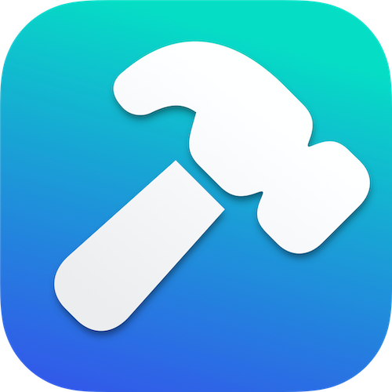

# Installation and configuration

The overall workflow is divided into a number of separate Shortcuts. Some of the Shortcuts – the primary actions in the scanning workflow – are meant to be invoked directly by the user; other Shortcuts act as helpers and are not meant to be invoked by users directly. All of them need to be installed on an iPhone for Popstar to function.

## Popstar software installation

There are two alternative approaches for installing Popstar, with variations possible within those general approaches. In addition, Popstar requires a certain third-party application to be installed as well.

Depending on your needs and preferences, the Popstar software can be installed directly on an iPhone, or it can be installed first on a MacOS computer or an iPad, and then taking advantage of the Apple's automatic synchronization of Shortcuts between devices that share the same Apple account ID. The latter approach only works if the account on the iPhone is tied to the same account on the Mac where the shortcuts are imported; however, editing Shortcuts is more convenient to do on a Mac than on an iPhone, so this approach is preferable for developers.

### Prerequisite software

 The Popstar Shortcuts rely on a free third-party application, [Toolbox Pro](https://toolboxpro.app), that must be installed separately. It can be found in the Apple App Store by searching for "Toolbox Pro". The app icon is a white hammer on a blue-green background; the version number at the time of this writing is 2024.4.

### Approach #1: using iCloud Links

Any Shortcut can be distributed online via Apple's servers such that users only need to open a certain URL and the Shortcuts app will initiate an installation process. We provide iCloud links for Popstar with each release. To install the Shortcuts this way, navigate to the [Popstar releases page on GitHub](https://github.com/caltechlibrary/popstar/releases) using a web browser, then underneath the section heading for the latest release on the page, look for a subsection titled _Installation links for the latest Shortcuts_. Find and click on the link for each Shortcut one at a time to install it.

### Approach #2: using files

Shortcuts can be saved as files, and the resulting files can be imported into the Shortcuts app. The files in the GitHub repository for Popstar can be loaded into the Shortcuts app this way (in effect, using GitHub's servers instead of Apple's iCloud servers). This approach is not recommended for most users because the files on GitHub may represent work in progress and not be in a state suitable for use by people other than the developers.

If you wish to proceed anyway, you can do it in one of two ways:

1. Visit <https://github.com/caltechlibrary/popstar/src> in a web browser, look for the files whose names end in `.shortcut`, and click on each file name in turn to install the Shortcuts.
2. Clone Popstar's GitHub repository to your local Mac computer, then visit the `src` subdirectory in the MacOS Finder, and double-click on each `.shortcut` file to make the Shortcuts app import them.

## (Optional) External keypad configuration

The Shortcuts app provides software buttons to run shortcuts, and in fact, is all that's really needed to run the Popstar workflow. However, reaching the buttons is difficult when the phone is mounted over a work surface. For this reason, we have been using a wireless button device to trigger the Popstar workflow steps.

### Device choice

Our current device is a [HUION Keydial Mini Bluetooth Programmable Keypad](https://web.archive.org/web/20240426133138/https://store.huion.com/products/huion-keydial-mini) bought in early April 2024 for approximately US $60.

<figure>

    <figcaption>Our HUION Keydial Mini Bluetooth Programmable Keypad, with custom labels that we printed, skillfully cut, and stuck on the keys we use for the Popstar workflow.</figcaption>
</figure>

There are many similar devices available via online retailers. Many others would likely do; the main criteria for a suitable device are that (1) it can pair with an iPhone, and (2) the buttons send keypress events that can be used as triggers for Shortcuts in the iOS accessibility preferences. (Not all bluetooth external keypad devices meet those criteria. This device by HUION was one of three tried; two worked suitably, and this one was chosen because it had a more convenient button layout.)

 We are currently using only 3 of the buttons, for the following actions:

1. Start a new destination box
2. Start a new destination folder within the current destination box
3. Take a photo of a document page to file in the current destination folder

There is an additional step, to initialize Popstar; this step must be performed once at the beginning of a new archiving project and requires typing text, so it is more convenient to do with the phone in hand and consequently does not need a hardware button assigned to it.

### Device Setup

Once the Shortcuts for the workflow are installed on an iPhone as described in a [section above](#popstar-software-installation), some additional and nonobvious steps are required to enable a device such as the HUION keypad to trigger Shortcuts on demand.

On iPhones running iOS 17 or earlier, the only method we have found is to set up the keypad using the iOS [Accessibility](https://web.archive.org/web/20240208094118/https://support.apple.com/guide/iphone/turn-on-accessibility-features-for-setup-iph2f623a095/17.0/ios/17.0) features. The following is the procedure we use:

1. On the phone, go to the iOS _Settings_ app
2. Tap on _Accessibility_
3. Scroll down the list to the section titled “physical and motor” and tap on _Keyboards_
4. Tap on _Full Keyboard Access_
5. Turn on _Full Keyboard Access_ via the toggle
6. Tap on _Commands_ in the middle of the same screen
7. Scroll the (long) list of items until you find the section titled “Shortcuts”
8. Look for the 3 main workflow shortcut names: "Start new destination box", "Start new destination folder", and "Take photo of document page"
9. Assign keys of your choosing to the 3 shortcuts

More information about using external keyboards with iPhones can be found in [documentation provided by Apple](
https://support.apple.com/guide/iphone/control-iphone-with-an-external-keyboard-ipha4375873f/17.0/ios/17.0
).
