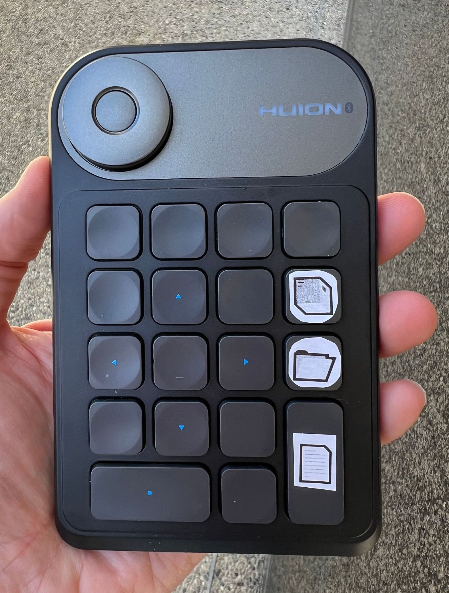

# External button keypad

After initially using voice recognition to trigger workflow steps, we decided that the use of button-based actions is preferable: it is faster that using computer-generated spoken prompts + voice recognition, and it allows the user to take as much time as they need in-between steps of the workflow (because the steps are performed on-demand by pressing a button). We are currently trial-testing the use of a wireless button pad to trigger workflow actions.

### Device choice

 The device we’re currently using is a [HUION Keydial Mini Bluetooth Programmable Keypad](https://web.archive.org/web/20240426133138/https://store.huion.com/products/huion-keydial-mini) bought in early April 2024 for approximately US $60. We are currently using only 3 of the buttons.

<figure>

    <figcaption>Our HUION Keydial Mini Bluetooth Programmable Keypad, with magnificent custom labels that we printed, skillfully cut, and stuck on the keys we use in the workflow.</figcaption>
</figure>

There are many similar devices available via online retailers. Almost any would likely do; the main criteria for a suitable device are that (1) it can pair with an iPhone, and (2) the buttons send keypress events that can be used as triggers for Shortcuts in the iOS accessibility preferences. (Not all bluetooth external keypad devices meet those criteria. This device by HUION was one of three tried; two worked suitably, and this one was chosen because it had a more convenient button layout.)

### Device Setup

Before you 

Once the Shortcuts for the workflow are installed on an iPhone as described in a [previous section](software.md), some additional and nonobvious steps are required to enable a device such as the HUION keypad to trigger Shortcuts on demand. On iPhones running iOS 17 or earlier, the only method we have found is to set up the keypad using the iOS [Accessibility](https://web.archive.org/web/20240208094118/https://support.apple.com/guide/iphone/turn-on-accessibility-features-for-setup-iph2f623a095/17.0/ios/17.0) features. The following is the procedure we use:

1. On the phone, go to the iOS _Settings_ app
2. Tap on _Accessibility_
3. Scroll down the list to the section titled “physical and motor” and tap on _Keyboards_
4. Tap on _Full Keyboard Access_
5. Turn on _Full Keyboard Access_ via the toggle
6. Tap on _Commands_ in the middle of the same screen
7. Scroll the (long) list of items until you find the section titled “Shortcuts”
8. Look for the 3 main workflow shortcut names: "Start new destination box", "Start new destination folder", and "Take photo of document page"
9. Assign keys of your choosing to the 3 shortcuts

https://support.apple.com/guide/iphone/control-iphone-with-an-external-keyboard-ipha4375873f/17.0/ios/17.0
