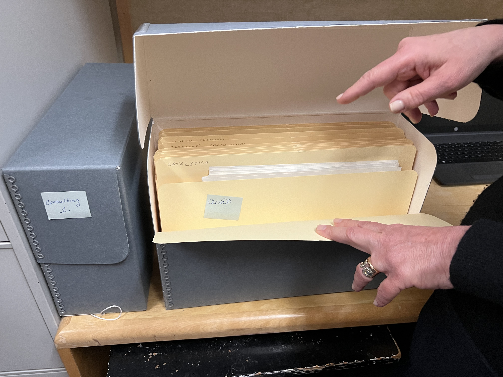
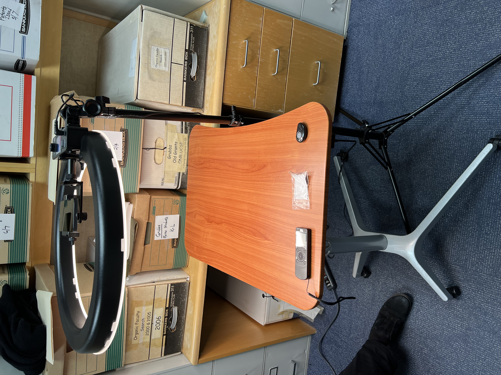
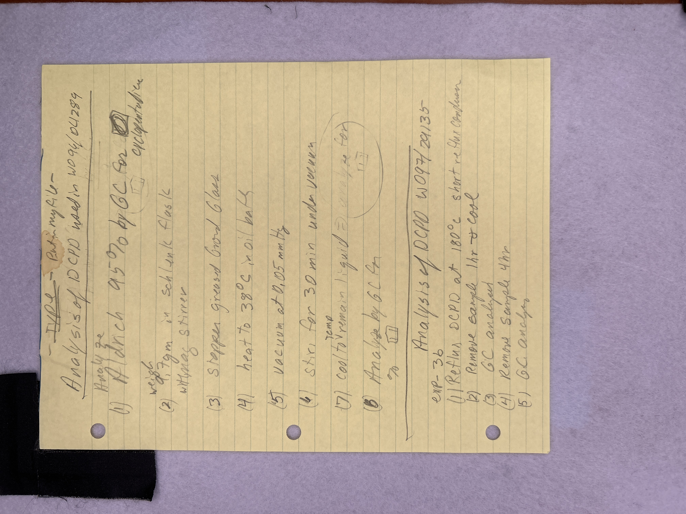

# The overall setup and workflow

One of the essential tasks for staff at the Caltech Library Archives is to select and scan paper materials that are in bankers boxes, and put them into archival boxes. A typical collection can consist of tens of thousands of pages of documents. The huge number of pages to be handled means that we need an efficient, simple, and fast workflow. Popstar (PhOne-based Processing SofTware for ARchives) is an experiment in creating such a workflow using commodity devices and software services.

## Example archiving project

The Caltech Archives recently accessioned materials from [Robert H. Grubbs](https://en.wikipedia.org/wiki/Robert_H._Grubbs). Grubbs was a Caltech faculty member and Nobel Prize winner in Chemistry. The hybrid collection consists of over 100 carton-sized boxes of papers and thousands of digital files and emails.

<figure>

    <figcaption>A small portion of the Robert H. Grubbs collection.</figcaption>
</figure>

We cannot keep all of the materials, so Caltech Archives personnel evaluate the materials to determine which ones should be kept and digitized. The physical materials that are kept are placed in archival boxes such as the ones shown below.

<figure>

    <figcaption>Archival boxes used to store selected materials from the collection.</figcaption>
</figure>

Inside the archival boxes, paper documents are organized using manila folders.

<figure>

    <figcaption>Archival boxes used to store selected materials from the collection. In the Popstar workflow, an archival box is referred to as "destination box" and a folder within the box is referred to as a "destination folder".</figcaption>
</figure>

## Example Popstar scanning setup

Our experiment in simple, rapid scanning used a height-adjustable table (for the comfort of staff doing the work) and a large ring light positioned above the table. The ring light has a phone mount in the middle where we place an Apple iPhone with the camera facing the table surface. On this iPhone, we install the Popstar software as described in the [Installation and configuration](installation.md) section of this document.

<figure>

    <figcaption>Our extremely basic scanning setup.</figcaption>
</figure>

We placed a gray felt pad on top of the table surface; this serves as a mat for placing document pages. The felt pad makes the surface less slippery for the papers, and also provides a more-or-less neutral background surrounding document pages so that borders may be more easily detected by later image processing steps. We also placed an "L" shape in one corner of the gray felt mat using Velcro-backed cloth to provide a placement guide for document pages.

<figure>

    <figcaption>Example of an actual document image taken by our workflow software. Document pages are placed on a gray mat that is itself placed on the table shown in the previous photo.</figcaption>
</figure>

Scanning proceeds in a straightforward fashion:

1. Initialize a new project by running the Shortcut _Initialize Popstar for new project_.
2. To start a new destination box (one of the gray archival boxes), we place a box label on the imaging surface (the gray felt pad mentioned above), then trigger the Popstar step _Start new destination box_. This step extracts the text written on the box label.
3. Next, we label a destination folder (a manila folder to be placed in the current destination box) and position it on the imaging surface, then trigger the Popstar step _Start new destination folder_. This step extracts the text written on the folder label.
4. Next, it's time to scan documents. For each document page that belongs in the current destination folder, we run the Popstar step _Take photo of document page_.
5. Go back to step 3 when it's time to start a new destination folder.
6. Go back to step 2 when it's time to start a new destination box.
7. Go back to step 1 when it's time to start a new scanning project.
